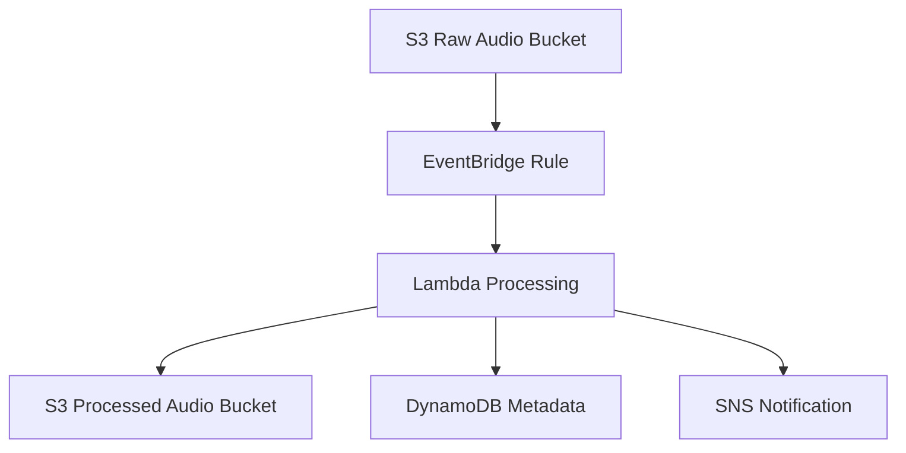

# Architecture

## Overview

This project implements an event-driven sleep audio pipeline using AWS CDK. The pipeline ingests raw sleep audio recordings, processes them, and stores results for downstream consumption.

## Pipeline Description

The sleep audio pipeline follows an event-driven architecture with the following stages:

1. **S3 Raw Ingest**: Raw sleep audio files are uploaded to an S3 bucket designated for incoming recordings. This serves as the entry point for the pipeline.

2. **EventBridge Rule**: An EventBridge rule is configured to trigger on S3 PutObject events from the raw audio bucket. This decouples the ingestion layer from processing, enabling reliable and scalable event routing.

3. **Lambda Processing**: A Lambda function is invoked by EventBridge to analyze and transcode the audio. Processing includes format conversion, noise analysis, sleep stage detection markers, and metadata extraction.

4. **S3 Processed Output**: Processed audio files (transcoded and annotated) are stored in a separate S3 bucket designated for processed outputs.

5. **DynamoDB Metadata Store**: Metadata extracted during processing (duration, quality metrics, sleep stage markers, timestamps) is persisted in a DynamoDB table for fast querying and retrieval.

6. **SNS Notification**: Upon successful processing, an SNS notification is published to inform downstream consumers (mobile apps, dashboards, analytics) that new results are available.

## Diagram

