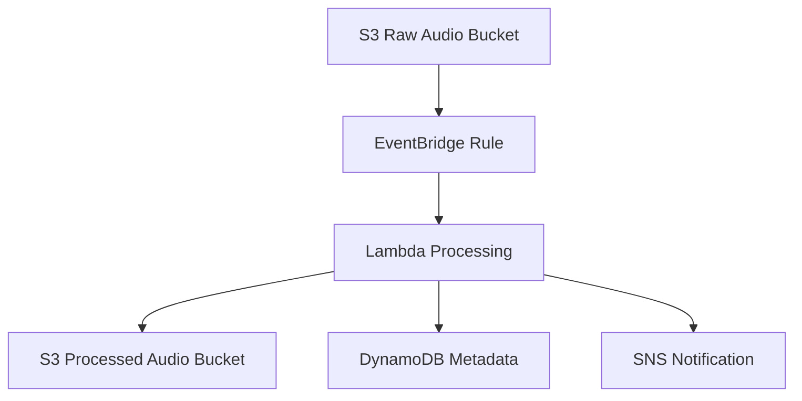

# Architecture

## Overview

This project will implement an event-driven sleep audio pipeline using AWS CDK. The following describes the planned architecture for ingesting raw sleep audio recordings, processing them, and storing results for downstream consumption.

## Pipeline Description

The planned sleep audio pipeline will follow an event-driven architecture with the following stages:

1. **S3 Raw Ingest**: Raw sleep audio files will be uploaded to an S3 bucket designated for incoming recordings. This will serve as the entry point for the pipeline.

2. **EventBridge Rule**: An EventBridge rule will be configured to trigger on S3 PutObject events from the raw audio bucket. This will decouple the ingestion layer from processing, enabling reliable and scalable event routing.

3. **Lambda Processing**: A Lambda function will be invoked by EventBridge to analyze and transcode the audio. Processing will include format conversion, noise analysis, sleep stage detection markers, and metadata extraction.

4. **S3 Processed Output**: Processed audio files (transcoded and annotated) will be stored in a separate S3 bucket designated for processed outputs.

5. **DynamoDB Metadata Store**: Metadata extracted during processing (duration, quality metrics, sleep stage markers, timestamps) will be persisted in a DynamoDB table for fast querying and retrieval.

6. **SNS Notification**: Upon successful processing, an SNS notification will be published to inform downstream consumers (mobile apps, dashboards, analytics) that new results are available.

## Diagram

