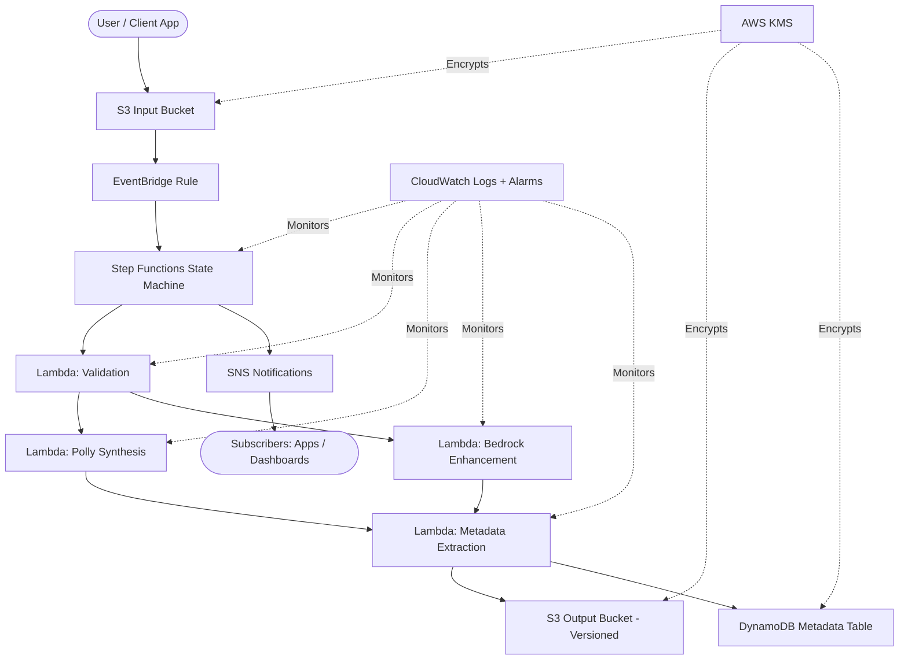

# Architecture

> **Status:** This document describes the *target architecture design* for the sleep audio pipeline. The CDK stack is currently a scaffold; implementation of individual components is tracked in subsequent issues. Sections below represent the planned system, not necessarily the current deployed state.

## High-Level Overview

This project implements an **event-driven sleep audio pipeline** using AWS CDK (TypeScript). The system ingests raw audio files, orchestrates multi-step processing through AWS Step Functions, and delivers processed audio alongside structured metadata to downstream consumers.

The architecture follows a serverless, event-driven pattern where each component is decoupled and independently scalable. AWS Step Functions serves as the central orchestrator, coordinating individual Lambda tasks for validation, voice synthesis, AI-enhanced audio processing, and metadata extraction. This design enables reliable, observable, and cost-efficient audio processing at any scale.

### Core Principles

- **Event-driven**: All processing is triggered by events, eliminating polling and reducing cost
- **Serverless-first**: No servers to manage; AWS handles scaling and availability
- **Least-privilege security**: Every component receives only the permissions it needs
- **Observable by default**: Structured logging, metrics, and alarms from day one
- **Multi-environment**: Dev, stage, and prod environments managed through CDK context

---

## Data Flow

The pipeline processes audio through the following stages:

### 1. Audio Upload (Ingestion)

Users or client applications upload raw audio files to the **S3 Input Bucket**. This bucket is configured with:

- Blocked public access (all public access settings disabled)
- Server-side encryption via AWS KMS
- Event notifications enabled for object creation

### 2. Event Detection (EventBridge)

An **EventBridge rule** listens for `PutObject` events from the S3 Input Bucket. EventBridge provides:

- Decoupled event routing between ingestion and processing
- Content-based filtering (e.g., only `.wav` or `.mp3` files trigger processing)
- Built-in retry and dead-letter queue support

When a matching event is detected, EventBridge invokes the Step Functions state machine.

### 3. Orchestrated Processing (Step Functions)

The **Step Functions state machine** orchestrates the full processing workflow. It coordinates the following Lambda tasks in sequence (with parallel branches where applicable):

#### 3a. Validation Lambda

- Verifies file format, size constraints, and audio integrity
- Extracts basic metadata (duration, sample rate, codec)
- Rejects invalid files early, sending an error notification via SNS

#### 3b. Polly Synthesis Lambda

- Uses **Amazon Polly** to generate soothing text-to-speech narration
- Produces calming voice overlays (guided meditation, sleep stories)
- Outputs synthesized audio segments for downstream mixing

#### 3c. Bedrock Enhancement Lambda (Optional)

- Leverages **Amazon Bedrock** for AI-generated ambient sleep sounds
- Applies audio enhancement techniques (noise smoothing, binaural beats)
- This step is optional and can be enabled per environment

#### 3d. Metadata Extraction Lambda

- Consolidates all processing metadata (duration, timestamps, user_id, processing status)
- Writes structured metadata to DynamoDB
- Prepares the final output record

### 4. Processed Output Storage

Processed audio files are written to the **S3 Output Bucket**, which is configured with:

- Versioning enabled (preserving all processed file versions)
- Server-side encryption via KMS
- Lifecycle policies for cost management (e.g., transition to Glacier after 90 days)

### 5. Metadata Persistence (DynamoDB)

A **DynamoDB table** stores metadata for each processed audio file:

- `audio_id` (partition key) - unique identifier for each processed file
- `user_id` - the user who uploaded the original file
- `duration` - audio duration in seconds
- `processing_status` - success, failed, or partial
- `created_at` - timestamp of processing completion
- `s3_output_key` - location of the processed file in the output bucket

DynamoDB provides single-digit millisecond read latency for metadata queries.

### 6. Notifications (SNS)

An **SNS topic** publishes notifications for:

- Successful processing completion (with output file location)
- Processing errors or validation failures (with error details)

Downstream consumers (mobile apps, dashboards, analytics pipelines) subscribe to receive these events.

---

## Diagram



---

## Key AWS Services

| Service | Role | Why This Service |
|---------|------|-----------------|
| **Amazon S3** | Input/output storage | Virtually unlimited object storage with event notifications, versioning, lifecycle management, and native KMS encryption. Ideal for large audio files. |
| **Amazon EventBridge** | Event routing | Fully managed event bus with content-based filtering, built-in retry, and dead-letter queues. Decouples ingestion from processing without custom glue code. |
| **AWS Step Functions** | Workflow orchestration | Visual workflow coordination with built-in error handling, retries, timeouts, and parallel execution. Tracks state across multi-step processing without custom orchestration code. Preferred over chaining Lambdas directly because it provides observability and reliable error recovery. |
| **AWS Lambda** | Task execution | Serverless compute for individual processing steps. Pay only for execution time. Scales automatically with demand. Each task is isolated for independent deployment and testing. |
| **Amazon Polly** | Text-to-speech | Neural TTS with natural-sounding voices. Produces high-quality speech synthesis for guided sleep content without training custom models. |
| **Amazon Bedrock** | AI audio enhancement | Managed foundation models for generative AI tasks. Enables AI-generated ambient sounds and audio enhancement without managing ML infrastructure. |
| **Amazon DynamoDB** | Metadata storage | Single-digit millisecond latency at any scale. Serverless, pay-per-request pricing aligns with event-driven workloads. No capacity planning required. |
| **Amazon SNS** | Notifications | Pub/sub messaging for fan-out to multiple subscribers. Supports email, SMS, HTTP/S, SQS, and Lambda destinations. Decouples notification delivery from processing logic. |
| **AWS KMS** | Encryption | Centralized key management for encryption at rest. Integrates natively with S3, DynamoDB, and other AWS services. Supports key rotation and audit logging. |
| **Amazon CloudWatch** | Observability | Unified logging, metrics, and alarms. Collects Lambda logs and Step Functions execution history. Enables proactive alerting on failures or latency spikes. |
| **AWS IAM** | Access control | Fine-grained, least-privilege permissions for every component. Each Lambda function and Step Functions execution role receives only the permissions it needs. |

---

## Security Considerations

### Least-Privilege IAM

- Each Lambda function has a dedicated execution role with only the permissions required for its specific task
- The Step Functions execution role can only invoke the Lambda tasks it orchestrates
- S3 bucket policies restrict access to authorized principals only
- No wildcard (`*`) resource permissions are used

### Encryption at Rest

- All S3 buckets use SSE-KMS (AWS KMS-managed keys) for server-side encryption
- DynamoDB table encryption is enabled with a KMS customer-managed key
- KMS key policies follow least-privilege principles with separate keys per environment

### Encryption in Transit

- All AWS API calls use TLS 1.2+
- S3 bucket policies enforce `aws:SecureTransport` condition to reject non-HTTPS requests

### Private Buckets

- All S3 buckets have `BlockPublicAccess` set to block all public access configurations
- No public bucket policies or ACLs are permitted
- Cross-account access is not enabled by default

### Additional Security Controls

- Lambda functions run inside VPC (if private resource access is needed) with security groups restricting egress
- CloudTrail logs all API calls for audit purposes
- KMS key usage is logged and auditable

---

## Observability Considerations

### Logging

- All Lambda functions emit structured JSON logs to CloudWatch Logs
- Step Functions execution history is retained for debugging failed workflows
- Log retention is set per environment (e.g., 7 days for dev, 30 days for stage, 90 days for prod)

### Metrics

- Lambda: invocation count, error count, duration, concurrent executions
- Step Functions: executions started, succeeded, failed, timed out
- S3: request count, bytes uploaded/downloaded
- DynamoDB: read/write capacity consumed, throttled requests

### Alarms

- **Processing failure rate**: Alarm when Step Functions failure rate exceeds threshold (e.g., >5% in 5 minutes)
- **Lambda errors**: Alarm on elevated error count for any processing Lambda
- **Latency**: Alarm when end-to-end processing time exceeds acceptable limits (e.g., >60 seconds)
- **DynamoDB throttling**: Alarm when throttled requests exceed zero

### Dashboards

- A CloudWatch dashboard provides a single-pane view of pipeline health
- Key widgets: processing throughput, error rate, average latency, active executions

---

## Cost Considerations

### Pay-Per-Use Model

The entire pipeline uses serverless, pay-per-use services. When no audio is being processed, the running cost is near zero.

| Service | Cost Driver | Optimization Strategy |
|---------|-------------|----------------------|
| Lambda | Invocation count + duration | Right-size memory allocation; minimize execution time |
| Step Functions | State transitions | Minimize unnecessary states; use Express Workflows for high-volume, short-duration executions |
| S3 | Storage + requests | Lifecycle policies to transition old files to Glacier or delete after retention period |
| DynamoDB | Read/write request units | Use on-demand (pay-per-request) mode; design efficient access patterns |
| Polly | Characters synthesized | Cache frequently used narrations; batch synthesis where possible |
| Bedrock | Input/output tokens | Use only when enhancement is requested; cache results for repeated inputs |
| EventBridge | Events published | Minimal cost; filter events to avoid unnecessary rule matching |
| SNS | Messages published + deliveries | Batch notifications where possible |
| CloudWatch | Log ingestion + storage + alarms | Set appropriate log retention; use metric filters instead of full-text search |
| KMS | API requests + key storage | Use AWS-managed keys where customer-managed keys are not required |

### Cost Optimization Tips

- Use S3 Intelligent-Tiering for output bucket if access patterns are unpredictable
- Consider Step Functions Express Workflows (vs. Standard) for high-volume, short-lived executions
- Set Lambda provisioned concurrency only if cold start latency is unacceptable
- Use DynamoDB on-demand mode during development; switch to provisioned if traffic is predictable in production

---

## Multi-Environment Support

The pipeline supports **dev**, **stage**, and **prod** environments through CDK context values.

### Configuration via CDK Context

```typescript
// cdk.json or via -c flag
{
  "context": {
    "environment": "dev",       // dev | stage | prod
    "enableBedrock": false,     // optional AI enhancement
    "logRetentionDays": 7,      // per-environment log retention
    "alarmThresholds": {
      "errorRate": 10,          // percentage
      "latencyMs": 120000       // milliseconds
    }
  }
}
```

### Environment Differences

| Aspect | Dev | Stage | Prod |
|--------|-----|-------|------|
| Log retention | 7 days | 30 days | 90 days |
| Alarms | Disabled or lenient | Enabled with relaxed thresholds | Enabled with strict thresholds |
| Bedrock | Disabled | Optional | Enabled |
| S3 lifecycle | Delete after 7 days | Delete after 30 days | Glacier after 90 days |
| KMS keys | AWS-managed | Customer-managed | Customer-managed with rotation |
| DynamoDB mode | On-demand | On-demand | Provisioned (if traffic is predictable) |

### Deployment

```bash
# Deploy to dev
npx cdk deploy --context environment=dev

# Deploy to production
npx cdk deploy --context environment=prod
```

---

## Future Extensibility

The event-driven, modular architecture supports several natural extension points:

### Additional Processing Steps

- New Lambda tasks can be added to the Step Functions state machine without modifying existing tasks
- Parallel branches enable adding new processing paths (e.g., waveform visualization, transcript generation)
- Choice states in Step Functions allow conditional routing based on file type or user preferences

### API Gateway Integration

- An API Gateway REST or HTTP API can expose endpoints for:
  - Generating pre-signed upload URLs for the S3 Input Bucket
  - Querying processing status from DynamoDB
  - Listing a user's processed audio files

### Real-Time Notifications

- WebSocket API (API Gateway v2) can push processing status updates to connected clients
- Replace or supplement SNS with EventBridge Pipes for more complex event routing

### Analytics and ML

- Kinesis Data Firehose can stream processing metadata to S3 for batch analytics
- Amazon Athena can query historical processing data without provisioning infrastructure
- SageMaker pipelines can train models on aggregated sleep audio patterns

### Content Delivery

- CloudFront distribution in front of the S3 Output Bucket for low-latency global audio delivery
- Signed URLs or signed cookies for authenticated access to processed content

### Multi-Region

- S3 Cross-Region Replication for disaster recovery
- DynamoDB Global Tables for multi-region metadata access
- Active-passive or active-active failover depending on RTO/RPO requirements
