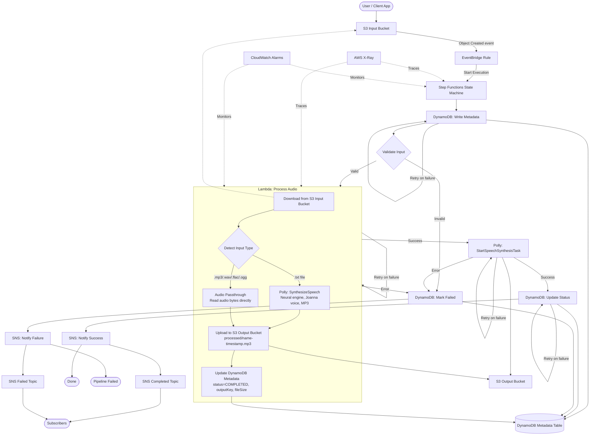

# Architecture

> **Status:** This document describes both the *currently implemented* resources and the *target architecture design* for the sleep audio pipeline. See the "Currently Implemented" section for what exists in the CDK stack today. The remaining sections describe the planned system.

## Currently Implemented

The following resources are deployed in the CDK stack today:

| Resource | Construct ID | Description |
|----------|-------------|-------------|
| **S3 Input Bucket** | `SleepAudioInputBucket` | Receives raw audio uploads. S3-managed encryption (AES256), versioning enabled, all public access blocked, EventBridge notifications enabled. |
| **S3 Output Bucket** | `SleepAudioOutputBucket` | Stores processed audio output. S3-managed encryption (AES256), versioning enabled, all public access blocked. |
| **EventBridge Rule** | `AudioUploadRule` | Triggers on `Object Created` events from the input bucket. Targets the Step Functions state machine. |
| **Step Functions State Machine** | `SleepAudioPipelineStateMachine` | Orchestrates the audio processing pipeline. Triggered by EventBridge on new audio uploads. CloudWatch logging enabled (level ALL). |
| **Polly Task State** | `Synthesize Speech` | Invokes Amazon Polly `StartSpeechSynthesisTask` to synthesize speech (voice: Joanna, format: MP3). Output written to the S3 Output Bucket. |
| **Validate Input (Choice)** | `Validate Input` | Choice state that fast-fails clearly invalid inputs. Checks: bucket name presence, object key presence, and file extension is a supported audio format (.wav, .mp3, .flac, .ogg). Invalid inputs route directly to the failure path. |
| **Lambda Function** | `SleepAudioProcessor` | Audio processing function (Node.js 22.x, 512MB memory, 120s timeout). Downloads input from S3, detects input type (text vs audio), synthesizes speech via Polly for text inputs or passes through audio files, uploads processed output to S3 Output Bucket, and updates DynamoDB metadata. Has S3 read access on input bucket, S3 write access on output bucket, polly:SynthesizeSpeech permission, and read/write access to the DynamoDB Metadata Table. Environment variables: TABLE_NAME, INPUT_BUCKET_NAME, OUTPUT_BUCKET_NAME. |
| **CDK Pipeline** | `PipelineStack` | Optional CDK Pipelines construct for CI/CD. Uses CodePipeline with a GitHub connection source and ShellStep synth. Deploys CdkBaseStack via a stage. Enabled via `--context enablePipeline=true`. |
| **DynamoDB Metadata Table** | `SleepAudioMetadataTable` | Stores audio pipeline metadata. Partition key: `audioId` (String). On-demand billing, AWS-managed encryption, point-in-time recovery enabled. |
| **SNS Completed Topic** | `PipelineCompletedTopic` | Publishes notification on successful pipeline completion. KMS-encrypted (aws/sns managed key). |
| **SNS Failed Topic** | `PipelineFailedTopic` | Publishes notification on pipeline failure. KMS-encrypted (aws/sns managed key). |

### Implemented Architecture Diagram



## Orchestration Layer

The **Step Functions state machine** (`SleepAudioPipelineStateMachine`) serves as the central orchestrator for the audio processing pipeline. It is triggered by EventBridge whenever a new audio file is uploaded to the S3 Input Bucket.

**Current pipeline states:**

1. **Write Metadata** - Writes initial metadata record to DynamoDB (audioId, status=PROCESSING, inputBucket, inputKey, createdAt).
2. **Validate Input** (Choice) - Fast-fail validation that checks: (a) `detail.bucket.name` is present, (b) `detail.object.key` is present, (c) file extension matches a supported audio format (.wav, .mp3, .flac, .ogg). If any check fails, routes directly to the Mark Failed state.
3. **Process Audio** - Invokes the `SleepAudioProcessor` Lambda function via `LambdaInvoke`. Performs full audio processing: downloads input from S3, detects input type, synthesizes speech via Polly (for text) or passes through audio data, uploads processed output to S3 Output Bucket, and updates DynamoDB metadata with output location and status. On failure, catches the error and transitions to the Mark Failed state.
4. **Synthesize Speech** - Invokes Amazon Polly `StartSpeechSynthesisTask` with configurable parameters (text from event input, voice: Joanna, format: MP3). The synthesized audio is written to the S3 Output Bucket. On failure, catches the error and transitions to the Mark Failed state.
5. **Update Status** - Updates the DynamoDB record status to COMPLETED with updatedAt timestamp.
6. **Notify Success** - Publishes a success notification to the SNS Completed topic (includes audioId and completion timestamp).
7. **Done** - Terminal success state.
8. **Mark Failed** (error path) - Updates the DynamoDB record status to FAILED with updatedAt timestamp.
9. **Notify Failure** (error path) - Publishes a failure notification to the SNS Failed topic (includes audioId and failure timestamp).
10. **Pipeline Failed** (error path) - Terminal failure state reached after marking the metadata record as FAILED.

**Error handling:**
- The Validate Input Choice state provides fast-fail for clearly invalid inputs (missing bucket/key or unsupported file extension), routing them directly to Mark Failed without invoking Lambda or Polly.
- The Process Audio Lambda has a Catch clause that routes errors to the Mark Failed state, handling runtime validation failures and unexpected exceptions. Uses catch-all (`States.ALL`) to ensure no error type can bypass the failure path.
- The Polly task has a Catch clause that routes all errors to the Mark Failed state, ensuring the DynamoDB metadata record accurately reflects pipeline failures instead of remaining stuck in PROCESSING status indefinitely. Uses catch-all (`States.ALL`) while retry remains scoped to `States.TaskFailed`.
- The Write Metadata task has a Catch clause routing errors to the Mark Failed state, handling DynamoDB write failures.
- The Update Status task has a Catch clause routing errors to the Mark Failed state, handling DynamoDB update failures.
- All failure paths converge on Mark Failed -> Notify Failure -> Pipeline Failed, ensuring consistent error reporting regardless of where the failure occurs.

**Retry policies:**

| Task | Error Types | Interval | Max Attempts | Backoff Rate |
|------|-------------|----------|--------------|--------------|
| Process Audio (Lambda) | States.TaskFailed, Lambda.ServiceException, Lambda.SdkClientException | 2s | 3 | 2.0 |
| Synthesize Speech (Polly) | States.TaskFailed | 3s | 2 | 2.0 |
| Write Metadata (DynamoDB) | States.ALL | 1s | 3 | 2.0 |
| Update Status (DynamoDB) | States.ALL | 1s | 3 | 2.0 |

All retries use exponential backoff. Retries are attempted before falling through to the Catch handler, so transient failures are automatically recovered without triggering the error path. The CDK LambdaInvoke default retry policy is disabled (`retryOnServiceExceptions: false`) to prevent duplicate retry entries and ensure only the custom retry applies.

### Input Validation

The pipeline employs a two-layer validation strategy:

**Layer 1: State Machine Choice State (fast-fail)**
- Checks `$.detail.bucket.name` is present (IsPresent)
- Checks `$.detail.object.key` is present (IsPresent)
- Validates file extension matches supported audio formats using StringMatches (`*.wav`, `*.mp3`, `*.flac`, `*.ogg`)
- Rejects clearly invalid inputs before invoking any compute resources

**Layer 2: Lambda Runtime Validation (detailed checks)**
- Validates that `detail.bucket.name` and `detail.object.key` exist and are non-empty
- Validates file extension is in the supported list (.wav, .mp3, .flac, .ogg)
- Throws descriptive `ValidationError` messages for each failure case
- Provides more detailed error information than the Choice state can express

**Supported file extensions:** `.wav`, `.mp3`, `.flac`, `.ogg`

**Required fields:** `detail.bucket.name`, `detail.object.key`

**Error behavior:** Validation failures at either layer route to FAILED status in DynamoDB and publish a failure notification to the SNS Failed topic, ensuring callers are always informed of rejected inputs.

**Security:**
- The state machine execution role follows least-privilege principles with permissions scoped to `polly:StartSpeechSynthesisTask`, `s3:PutObject` on the output bucket, `lambda:InvokeFunction` on the SleepAudioProcessor, and DynamoDB operations on the metadata table only.
- The Lambda execution role has S3 read access on the input bucket, S3 write access on the output bucket, polly:SynthesizeSpeech permission, read/write access to the DynamoDB Metadata Table, CloudWatch Logs permissions for observability, and X-Ray tracing permissions.
- CloudWatch logging is enabled at level ALL with execution data included for full observability.

### Observability

The pipeline implements comprehensive observability through multiple layers:

**X-Ray Tracing:**
- The Lambda function (`SleepAudioProcessor`) has active X-Ray tracing enabled, providing end-to-end request tracing and performance insights.
- The Step Functions state machine has tracing enabled, allowing distributed trace correlation across all pipeline states.

**Structured Logging:**
- The Lambda handler uses structured JSON logging with fields: `timestamp`, `level`, `message`, `requestId`, `functionName`, and contextual data.
- All log entries include the AWS request ID for correlation with X-Ray traces.
- Log levels: INFO for normal operations, ERROR for validation failures and exceptions.

**CloudWatch Alarms:**

| Alarm | Metric | Namespace | Threshold | Period | Evaluation Periods |
|-------|--------|-----------|-----------|--------|-------------------|
| State Machine Failures | ExecutionsFailed | AWS/States | >= 1 | 60s | 5 |
| Lambda Errors | Errors | AWS/Lambda | >= 1 | 60s | 5 |

Both alarms use Sum statistic with GreaterThanOrEqualToThreshold comparison, triggering when at least one failure occurs within a 5-minute evaluation window. Both alarms are wired to the `PipelineFailedTopic` SNS topic via alarm actions, ensuring operators are notified when alarms fire.

**Future states** (to be added in subsequent features): Bedrock audio enhancement and metadata extraction.

## Audio Processing Logic

The `SleepAudioProcessor` Lambda function performs the core audio processing within the pipeline. It handles the full lifecycle from downloading input to storing processed output and updating metadata.

### Processing Steps

1. **S3 Download** - The Lambda downloads the input file from the S3 Input Bucket using the bucket name and object key provided in the event payload.
2. **Input Type Detection** - The file extension determines the processing path:
   - `.txt` files are treated as text prompts for speech synthesis
   - `.mp3`, `.wav`, `.flac`, `.ogg` files are treated as audio for passthrough processing
3. **Processing**:
   - **Text input (Polly synthesis)** - For `.txt` files, the Lambda calls Amazon Polly `SynthesizeSpeech` with the neural engine, Joanna voice, and MP3 output format. The text content of the file is converted into natural-sounding speech audio.
   - **Audio input (passthrough)** - For audio files, the Lambda reads the raw audio bytes and passes them through directly. This path serves as a placeholder for future audio DSP enhancements (normalization, mixing, effects).
4. **S3 Upload** - The processed audio output is uploaded to the S3 Output Bucket with the naming convention: `processed/<original-key-without-extension>-<timestamp>.mp3`
5. **DynamoDB Metadata Update** - The Lambda updates the metadata record with the following fields:
   - `status` = `COMPLETED`
   - `outputBucket` - the name of the S3 Output Bucket
   - `outputKey` - S3 URI of the processed output file
   - `fileSize` - size of the processed output in bytes
   - `processedAt` - ISO 8601 timestamp of processing completion

### Output Artifacts

| Artifact | Location | Format |
|----------|----------|--------|
| Processed audio file | `s3://<output-bucket>/processed/<name>-<timestamp>.mp3` | MP3 |
| Metadata record | DynamoDB Metadata Table (keyed by `audioId`) | JSON attributes |

### Lambda Configuration

| Setting | Value | Rationale |
|---------|-------|-----------|
| Runtime | Node.js 22.x | Latest LTS with built-in AWS SDK v3 |
| Memory | 512MB | Sufficient for audio file buffering and Polly responses |
| Timeout | 120s | Allows time for S3 transfers and Polly synthesis of longer texts |
| Tracing | AWS X-Ray (active) | End-to-end performance visibility |

### IAM Permissions

| Permission | Scope | Purpose |
|------------|-------|---------|
| S3 read | Input Bucket | Download input files for processing |
| S3 write | Output Bucket | Upload processed audio output |
| polly:SynthesizeSpeech | All resources | Synthesize speech from text prompts |
| DynamoDB read/write | Metadata Table | Update processing status and output metadata |
| CloudWatch Logs | Log group | Emit structured logs |
| X-Ray | Tracing | Publish trace segments |

## Notification Layer

The pipeline uses **Amazon SNS** to notify downstream consumers of pipeline outcomes.

| Topic | Construct ID | Purpose |
|-------|-------------|---------|
| `SleepAudioPipelineCompleted` | `PipelineCompletedTopic` | Published on successful pipeline completion. Message includes audioId and completion timestamp. |
| `SleepAudioPipelineFailed` | `PipelineFailedTopic` | Published on pipeline failure. Message includes audioId and failure timestamp. |

Both topics are encrypted at rest using the AWS-managed SNS KMS key (`alias/aws/sns`), ensuring notification payloads are protected without the overhead of managing custom KMS keys.

Subscribers (mobile apps, dashboards, alerting systems) can subscribe to one or both topics to receive real-time pipeline status updates. The SNS Publish tasks are integrated directly into the Step Functions state machine as task states, ensuring notifications are sent reliably as part of the orchestrated workflow.

## Metadata Layer

The **DynamoDB Metadata Table** (`SleepAudioMetadataTable`) tracks the execution state of each audio processing pipeline run. When a new audio file triggers the pipeline, the state machine writes an initial record with status `PROCESSING` before beginning synthesis. After successful Polly synthesis, the record is updated to `COMPLETED` with a timestamp. This provides a queryable audit trail of all pipeline executions and their outcomes, enabling downstream consumers to check processing status without polling the state machine directly.

## Deployment & Environments

The pipeline supports multi-environment deployment through CDK context values. The environment is read from the `environment` context variable and defaults to `dev` if not specified.

### Setting the Environment

```bash
# Deploy to dev (default)
npx cdk deploy

# Deploy to staging
npx cdk deploy --context environment=staging

# Deploy to production
npx cdk deploy --context environment=prod
```

The environment value is applied as a tag (`environment`) on all resources in the stack, enabling cost allocation and resource identification by environment.

### CDK Pipelines Construct

The project includes an optional `PipelineStack` (`lib/pipeline-stack.ts`) that implements a CI/CD pipeline using CDK Pipelines. It is enabled by setting the `enablePipeline` context flag:

```bash
npx cdk deploy --context enablePipeline=true
```

The pipeline construct:
- Sources code from a GitHub connection (placeholder ARN, to be configured per account)
- Runs `npm ci` and `npx cdk synth` in a ShellStep for synthesis
- Deploys the `CdkBaseStack` via a deployment stage

This is a skeleton that can be extended with additional stages (e.g., manual approval, integration tests) as needed.

---

## High-Level Overview (Target Architecture)

This project implements an **event-driven sleep audio pipeline** using AWS CDK (TypeScript). The system ingests raw audio files, orchestrates multi-step processing through AWS Step Functions, and delivers processed audio alongside structured metadata to downstream consumers.

The architecture follows a serverless, event-driven pattern where each component is decoupled and independently scalable. AWS Step Functions serves as the central orchestrator, coordinating individual Lambda tasks for validation, voice synthesis, AI-enhanced audio processing, and metadata extraction. This design enables reliable, observable, and cost-efficient audio processing at any scale.

### Core Principles

- **Event-driven**: All processing is triggered by events, eliminating polling and reducing cost
- **Serverless-first**: No servers to manage; AWS handles scaling and availability
- **Least-privilege security**: Every component receives only the permissions it needs
- **Observable by default**: Structured logging, metrics, and alarms from day one
- **Multi-environment**: Dev, stage, and prod environments managed through CDK context

---

## Data Flow

The pipeline processes audio through the following stages:

### 1. Audio Upload (Ingestion)

Users or client applications upload raw audio files to the **S3 Input Bucket**. This bucket is configured with:

- Blocked public access (all public access settings blocked)
- Server-side encryption via AWS KMS
- Event notifications enabled for object creation

### 2. Event Detection (EventBridge)

An **EventBridge rule** listens for `PutObject` events from the S3 Input Bucket. EventBridge provides:

- Decoupled event routing between ingestion and processing
- Content-based filtering (e.g., only `.wav` or `.mp3` files trigger processing)
- Built-in retry and dead-letter queue support

When a matching event is detected, EventBridge invokes the Step Functions state machine.

### 3. Orchestrated Processing (Step Functions)

The **Step Functions state machine** orchestrates the full processing workflow. It coordinates the following Lambda tasks in sequence (with parallel branches where applicable):

#### 3a. Validation Lambda

- Verifies file format, size constraints, and audio integrity
- Extracts basic metadata (duration, sample rate, codec)
- Rejects invalid files early; the workflow publishes an error notification via SNS
#### 3b. Polly Synthesis Lambda

- Uses **Amazon Polly** to generate soothing text-to-speech narration
- Produces calming voice overlays (guided meditation, sleep stories)
- Outputs synthesized audio segments for downstream mixing

#### 3c. Bedrock Enhancement Lambda (Optional)

- Leverages **Amazon Bedrock** for AI-generated ambient sleep sounds
- Applies audio enhancement techniques (noise smoothing, binaural beats)
- This step is optional and can be enabled per environment

#### 3d. Metadata Extraction Lambda

- Consolidates all processing metadata (duration, timestamps, user_id, processing status)
- Writes structured metadata to DynamoDB
- Prepares the final output record

### 4. Processed Output Storage

Processed audio files are written to the **S3 Output Bucket**, which is configured with:

- Versioning enabled (preserving all processed file versions)
- Server-side encryption via KMS
- Lifecycle policies for cost management (e.g., transition to Glacier after 90 days)

### 5. Metadata Persistence (DynamoDB)

A **DynamoDB table** stores metadata for each processed audio file:

- `audio_id` (partition key) - unique identifier for each processed file
- `user_id` - the user who uploaded the original file
- `duration` - audio duration in seconds
- `processing_status` - success, failed, or partial
- `created_at` - timestamp of processing completion
- `s3_output_key` - location of the processed file in the output bucket

DynamoDB provides single-digit millisecond read latency for metadata queries.

### 6. Notifications (SNS)

An **SNS topic** publishes notifications for:

- Successful processing completion (with output file location)
- Processing errors or validation failures (with error details)

Downstream consumers (mobile apps, dashboards, analytics pipelines) subscribe to receive these events.

---

## Diagram (Target Architecture)


---

## Key AWS Services

| Service | Role | Why This Service |
|---------|------|-----------------|
| **Amazon S3** | Input/output storage | Virtually unlimited object storage with event notifications, versioning, lifecycle management, and native KMS encryption. Ideal for large audio files. |
| **Amazon EventBridge** | Event routing | Fully managed event bus with content-based filtering, built-in retry, and dead-letter queues. Decouples ingestion from processing without custom glue code. |
| **AWS Step Functions** | Workflow orchestration | Visual workflow coordination with built-in error handling, retries, timeouts, and parallel execution. Tracks state across multi-step processing without custom orchestration code. Preferred over chaining Lambdas directly because it provides observability and reliable error recovery. |
| **AWS Lambda** | Task execution | Serverless compute for individual processing steps. Pay only for execution time. Scales automatically with demand. Each task is isolated for independent deployment and testing. |
| **Amazon Polly** | Text-to-speech | Neural TTS with natural-sounding voices. Produces high-quality speech synthesis for guided sleep content without training custom models. |
| **Amazon Bedrock** | AI audio enhancement | Managed foundation models for generative AI tasks. Enables AI-generated ambient sounds and audio enhancement without managing ML infrastructure. |
| **Amazon DynamoDB** | Metadata storage | Single-digit millisecond latency at any scale. Serverless, pay-per-request pricing aligns with event-driven workloads. No capacity planning required. |
| **Amazon SNS** | Notifications | Pub/sub messaging for fan-out to multiple subscribers. Supports email, SMS, HTTP/S, SQS, and Lambda destinations. Decouples notification delivery from processing logic. |
| **AWS KMS** | Encryption | Centralized key management for encryption at rest. Integrates natively with S3, DynamoDB, and other AWS services. Supports key rotation and audit logging. |
| **Amazon CloudWatch** | Observability | Unified logging, metrics, and alarms. Collects Lambda logs and Step Functions execution history. Enables proactive alerting on failures or latency spikes. |
| **AWS IAM** | Access control | Fine-grained, least-privilege permissions for every component. Each Lambda function and Step Functions execution role receives only the permissions it needs. |

---

## Security Considerations

### Least-Privilege IAM

- Each Lambda function has a dedicated execution role with only the permissions required for its specific task
- The Step Functions execution role can only invoke the Lambda tasks it orchestrates
- S3 bucket policies restrict access to authorized principals only
- Avoid wildcard (`*`) resource permissions where possible; if required, scope them to the narrowest practical actions and resources
### Encryption at Rest

- All S3 buckets use SSE-KMS (AWS KMS-managed keys) for server-side encryption
- DynamoDB table encryption is enabled with a KMS customer-managed key
- KMS key policies follow least-privilege principles with separate keys per environment

### Encryption in Transit

- All AWS API calls use TLS 1.2+
- S3 bucket policies enforce `aws:SecureTransport` condition to reject non-HTTPS requests

### Private Buckets

- All S3 buckets have `BlockPublicAccess` set to block all public access configurations
- No public bucket policies or ACLs are permitted
- Cross-account access is not enabled by default

### Additional Security Controls

- Lambda functions run inside VPC (if private resource access is needed) with security groups restricting egress
- CloudTrail logs all API calls for audit purposes
- KMS key usage is logged and auditable

---

## Observability Considerations

### Logging

- All Lambda functions emit structured JSON logs to CloudWatch Logs
- Step Functions execution history is retained for debugging failed workflows
- Log retention is set per environment (e.g., 7 days for dev, 30 days for stage, 90 days for prod)

### Metrics

- Lambda: invocation count, error count, duration, concurrent executions
- Step Functions: executions started, succeeded, failed, timed out
- S3: request count, bytes uploaded/downloaded
- DynamoDB: read/write capacity consumed, throttled requests

### Alarms

- **Processing failure rate**: Alarm when Step Functions failure rate exceeds threshold (e.g., >5% in 5 minutes)
- **Lambda errors**: Alarm on elevated error count for any processing Lambda
- **Latency**: Alarm when end-to-end processing time exceeds acceptable limits (e.g., >60 seconds)
- **DynamoDB throttling**: Alarm when throttled requests exceed zero

### Dashboards

- A CloudWatch dashboard provides a single-pane view of pipeline health
- Key widgets: processing throughput, error rate, average latency, active executions

---

## Cost Considerations

### Pay-Per-Use Model

The entire pipeline uses serverless, pay-per-use services. When no audio is being processed, the running cost is near zero.

| Service | Cost Driver | Optimization Strategy |
|---------|-------------|----------------------|
| Lambda | Invocation count + duration | Right-size memory allocation; minimize execution time |
| Step Functions | State transitions | Minimize unnecessary states; use Express Workflows for high-volume, short-duration executions |
| S3 | Storage + requests | Lifecycle policies to transition old files to Glacier or delete after retention period |
| DynamoDB | Read/write request units | Use on-demand (pay-per-request) mode; design efficient access patterns |
| Polly | Characters synthesized | Cache frequently used narrations; batch synthesis where possible |
| Bedrock | Input/output tokens | Use only when enhancement is requested; cache results for repeated inputs |
| EventBridge | Events published | Minimal cost; filter events to avoid unnecessary rule matching |
| SNS | Messages published + deliveries | Batch notifications where possible |
| CloudWatch | Log ingestion + storage + alarms | Set appropriate log retention; use metric filters instead of full-text search |
| KMS | API requests + key storage | Use AWS-managed keys where customer-managed keys are not required |

### Cost Optimization Tips

- Use S3 Intelligent-Tiering for output bucket if access patterns are unpredictable
- Consider Step Functions Express Workflows (vs. Standard) for high-volume, short-lived executions
- Set Lambda provisioned concurrency only if cold start latency is unacceptable
- Use DynamoDB on-demand mode during development; switch to provisioned if traffic is predictable in production

---

## Multi-Environment Support

The pipeline supports **dev**, **stage**, and **prod** environments through CDK context values.

### Configuration via CDK Context

~~~json
{
  "context": {
    "environment": "dev",
    "enableBedrock": false,
    "logRetentionDays": 7,
    "alarmThresholds": {
      "errorRate": 10,
      "latencyMs": 120000
    }
  }
}
~~~

### Environment Differences

| Aspect | Dev | Stage | Prod |
|--------|-----|-------|------|
| Log retention | 7 days | 30 days | 90 days |
| Alarms | Disabled or lenient | Enabled with relaxed thresholds | Enabled with strict thresholds |
| Bedrock | Disabled | Optional | Enabled |
| S3 lifecycle | Delete after 7 days | Delete after 30 days | Glacier after 90 days |
| KMS keys | AWS-managed | Customer-managed | Customer-managed with rotation |
| DynamoDB mode | On-demand | On-demand | Provisioned (if traffic is predictable) |

### Deployment

```bash
# Deploy to dev
npx cdk deploy --context environment=dev

# Deploy to production
npx cdk deploy --context environment=prod
```

---

## Future Extensibility

The event-driven, modular architecture supports several natural extension points:

### Additional Processing Steps

- New Lambda tasks can be added to the Step Functions state machine without modifying existing tasks
- Parallel branches enable adding new processing paths (e.g., waveform visualization, transcript generation)
- Choice states in Step Functions allow conditional routing based on file type or user preferences

### API Gateway Integration

- An API Gateway REST or HTTP API can expose endpoints for:
  - Generating pre-signed upload URLs for the S3 Input Bucket
  - Querying processing status from DynamoDB
  - Listing a user's processed audio files

### Real-Time Notifications

- WebSocket API (API Gateway v2) can push processing status updates to connected clients
- Replace or supplement SNS with EventBridge Pipes for more complex event routing

### Analytics and ML

- Kinesis Data Firehose can stream processing metadata to S3 for batch analytics
- Amazon Athena can query historical processing data without provisioning infrastructure
- SageMaker pipelines can train models on aggregated sleep audio patterns

### Content Delivery

- CloudFront distribution in front of the S3 Output Bucket for low-latency global audio delivery
- Signed URLs or signed cookies for authenticated access to processed content

### Multi-Region

- S3 Cross-Region Replication for disaster recovery
- DynamoDB Global Tables for multi-region metadata access
- Active-passive or active-active failover depending on RTO/RPO requirements
