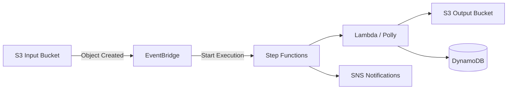

# CDK Sleep Audio Pipeline

[](https://github.com/obstreperous-ai/cdk-sleep-ts-kiro/actions/workflows/ci.yml)


An AWS CDK TypeScript project implementing an event-driven sleep audio processing pipeline. The system ingests audio files (or text prompts) via S3, orchestrates multi-step processing through AWS Step Functions, synthesizes speech with Amazon Polly, stores processed output, tracks metadata in DynamoDB, and delivers notifications through SNS.

**Built entirely with AI coding agents using strict Test-Driven Development.**

---

## Table of Contents

- [Architecture Overview](#architecture-overview)
- [Experiment Methodology](#experiment-methodology)
- [Experiment Design Document](#experiment-design-document)
- [Meta-Prompting & Agent Guidelines](#meta-prompting--agent-guidelines)
- [Environment Setup](#environment-setup)
- [Development](#development)
- [Usage](#usage)
- [Multi-Environment Deployment](#multi-environment-deployment)
- [TDD Rules](#tdd-rules)
- [Useful Commands](#useful-commands)
- [Troubleshooting](#troubleshooting)
- [Contributing](#contributing)

---

## Architecture Overview

The pipeline follows a serverless, event-driven design:

1. **Ingestion** - Audio files or text prompts are uploaded to the S3 Input Bucket.
2. **Event Detection** - EventBridge detects new objects and triggers the Step Functions state machine.
3. **Orchestration** - Step Functions coordinates validation, processing, and notification steps.
4. **Processing** - A Lambda function downloads input, detects type (text vs. audio), synthesizes speech via Polly for text inputs (or passes through audio), and uploads processed output.
5. **Polly Synthesis** - The state machine also invokes Polly `StartSpeechSynthesisTask` for direct synthesis.
6. **Metadata** - DynamoDB tracks pipeline execution state from PROCESSING to COMPLETED or FAILED.
7. **Notifications** - SNS topics publish success or failure notifications to subscribers.

### High-Level Architecture



For the full architecture details, component descriptions, state machine definition, retry policies, and the detailed Mermaid diagram, see [ARCHITECTURE.md](./ARCHITECTURE.md).

## Experiment Methodology

This project was developed as an experiment in building production-quality cloud infrastructure entirely through AI coding agents. The methodology centers on five key practices:

### Pure Issue-Driven Development

The entire system was built through **12+ iterative GitHub issues**, each representing a bounded unit of work that built on the verified output of previous issues. No code was written outside the context of a tracked issue. Each issue contained explicit requirements, ordered tasks, and measurable success criteria.

### Strict TDD (Test-First Always)

Every feature followed a rigid Red-Green-Refactor cycle:
- A failing test was written first, defining the expected behavior
- Only the minimal implementation needed to pass the test was added
- Refactoring occurred only with all tests green

This approach produced 196 tests covering 100% of infrastructure resources, Lambda handler logic, pipeline orchestration, and end-to-end validation scenarios.

### Conventional Commits as Audit Trail

Every commit uses [Conventional Commits](https://www.conventionalcommits.org/) format (`feat:`, `fix:`, `chore:`, `docs:`, `refactor:`), creating a machine-readable history that documents exactly what changed and why. The git log serves as a complete audit trail of the project's evolution.

### ARCHITECTURE.md as Living Design Document

[ARCHITECTURE.md](./ARCHITECTURE.md) was updated with every infrastructure change, ensuring the documentation always accurately reflects the implementation. The Mermaid diagram, component table, and detailed sections stay synchronized with the code.

### Incremental, Compounding Iterations

Each issue assumed the previous issue's work was complete and tested. This incremental approach meant:
- No large-scale rewrites or integration phases
- Each new feature built on a verified, working foundation
- Regressions were caught immediately by the existing test suite
- The architecture grew organically from simple to complex

For the full experiment design, methodology details, issue history, and preliminary observations, see [EXPERIMENT.md](./EXPERIMENT.md).

## Experiment Design Document

This project is one cell in a **5-language x 3-AI experimental matrix** evaluating how AI coding agents perform when building production-quality cloud infrastructure under strict methodological constraints.

[EXPERIMENT.md](./EXPERIMENT.md) captures the complete experimental design including:
- Experimental setup and research questions
- Detailed methodology (TDD, issue-driven development, architecture-as-code)
- Actor and toolchain documentation
- Prompting patterns and the 5-discipline meta-prompting framework
- Full issue history with test growth trajectory
- Key architectural decisions and trade-offs
- Preliminary observations on strengths, challenges, and agent behavior

## Meta-Prompting & Agent Guidelines

This project was built primarily with AI coding agents, guided by structured prompts and discipline protocols. The patterns used to direct these agents are documented and reusable:

- **[META-PROMPTS.md](./META-PROMPTS.md)** - Reusable prompt templates, workflow patterns, and best practices for directing AI agents to build TDD infrastructure-as-code projects.
- **[.github/AGENT_GUIDELINES.md](./.github/AGENT_GUIDELINES.md)** - Comprehensive guidelines defining the agent's role, TDD discipline, CDK best practices, validation checklist, and issue execution protocol.

These documents capture the meta-prompting strategies that emerged from building this system: how to structure issues for agent consumption, how to enforce TDD discipline through prompt design, and what patterns produce the most reliable results.

## Environment Setup

### Prerequisites

- **Node.js 22** (LTS) - [Download](https://nodejs.org/)
- **npm** (included with Node.js)
- **AWS CDK CLI** - Install globally: `npm install -g aws-cdk`
- **AWS CLI** (for deployment) - Configured with appropriate credentials and region

### Install Dependencies

```bash
npm ci
```

## Development

### Build

```bash
npx tsc
```

### Run Tests

```bash
npm test
```

### Synthesize CloudFormation Template

```bash
npx cdk synth --context environment=dev
```

### Deploy

```bash
# Deploy to your configured AWS account/region
npx cdk deploy --context environment=dev
```

## Usage

### Triggering the Pipeline

Upload an audio file or text prompt to the S3 Input Bucket:

```bash
# Upload an audio file for passthrough processing
aws s3 cp my-audio.mp3 s3://<input-bucket-name>/my-audio.mp3

# Upload a text file for Polly speech synthesis
aws s3 cp sleep-script.txt s3://<input-bucket-name>/sleep-script.txt
```

The pipeline will automatically:
1. Detect the upload via EventBridge
2. Validate the input (supported extensions: `.wav`, `.mp3`, `.flac`, `.ogg`, `.txt`)
3. Process the file (Polly synthesis for text, passthrough for audio)
4. Store processed output in the S3 Output Bucket as `processed/<name>-<timestamp>.mp3`
5. Update metadata in DynamoDB
6. Publish a success notification to the SNS Completed topic

If processing fails at any step, the pipeline marks the record as FAILED and publishes a failure notification.

### Supported File Types

| Extension | Processing Path |
|-----------|----------------|
| `.txt` | Text-to-speech via Amazon Polly (neural engine, Joanna voice, MP3 output) |
| `.mp3`, `.wav`, `.flac`, `.ogg` | Audio passthrough (placeholder for future DSP enhancements) |

## Multi-Environment Deployment

The pipeline supports deployment to multiple environments through CDK context values:

```bash
# Development (default)
npx cdk deploy

# Staging
npx cdk deploy --context environment=staging

# Production
npx cdk deploy --context environment=prod
```

The environment value is applied as a tag on all resources and used in the state machine name (`SleepAudioPipeline-<env>`), enabling cost allocation and resource identification.

### CDK Pipeline (CI/CD)

An optional CDK Pipelines construct is available for automated deployments:

```bash
npx cdk deploy --context enablePipeline=true
```

This provisions a CodePipeline that sources from GitHub, runs synthesis, and deploys the stack. See [ARCHITECTURE.md](./ARCHITECTURE.md) for details.

## TDD Rules

This project follows strict Test-Driven Development:

1. **Always write a failing test first** before any implementation code.
2. **Write the minimal code** to make the failing test pass.
3. **Refactor** while keeping all tests green.
4. **Keep ARCHITECTURE.md in sync** with every infrastructure change, including the Mermaid diagram.

Never push code that does not have a corresponding test written before the implementation.

## Useful Commands

| Command | Description |
|---------|-------------|
| `npm test` | Run the full Jest test suite |
| `npx tsc` | Compile TypeScript |
| `npx cdk synth` | Emit synthesized CloudFormation template |
| `npx cdk deploy` | Deploy stack to AWS |
| `npx cdk diff` | Compare deployed stack with current state |
| `npx cdk destroy` | Remove the stack from AWS |

## Troubleshooting

### Tests fail with snapshot mismatch

If you intentionally changed CDK infrastructure, update the snapshot:

```bash
npx jest --no-coverage -u
```

### CDK synth fails with "Cannot find module"

Ensure dependencies are installed and TypeScript compiles cleanly:

```bash
npm ci
npx tsc
```

### Deployment fails with permission errors

Verify your AWS credentials are configured and have sufficient permissions:

```bash
aws sts get-caller-identity
```

Ensure the CDK bootstrap stack exists in your target account/region:

```bash
npx cdk bootstrap aws://<account-id>/<region>
```

### Lambda timeout during processing

The Lambda function has a 120-second timeout. For very large text files, consider splitting input into smaller chunks. Audio files up to 100 MB are supported.

### NODE_OPTIONS conflict in CI/sandbox environments

If you encounter `NODE_OPTIONS` conflicts, unset it before running commands:

```bash
unset NODE_OPTIONS && npx jest --no-coverage
```

## Contributing

See [CONTRIBUTING.md](./CONTRIBUTING.md) for development workflow, commit conventions, and pull request process.
